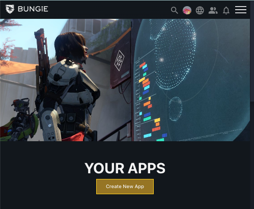
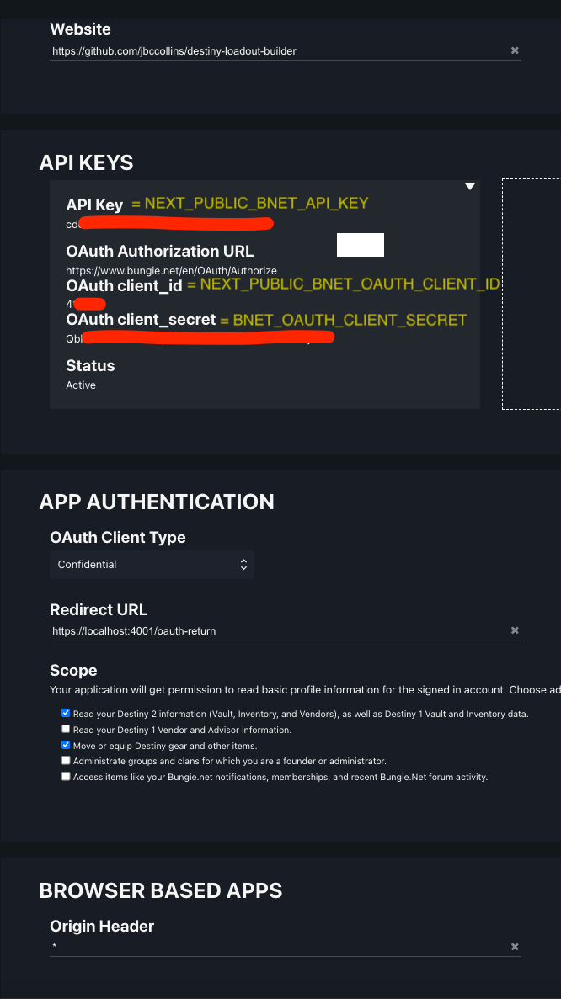

This is a [Next.js](https://nextjs.org/) project bootstrapped with [`create-next-app`](https://github.com/vercel/next.js/tree/canary/packages/create-next-app).

## Getting Started

#### Create a your own Bungie third-party developer app
You will need to create your own app at https://www.bungie.net/en/Application.


We will add the credentials from this app into your local environment file in the next step

Configure the fields in your app to be just like this screenshot.
> Make sure you have set the `OAuth Client Type` dropdown, `Scope` checkboxs and `Origin Header` text field to match exactly with what is in the screenshot.

The `Website` text field can just point to your fork of the repo. It doesn't really matter.


#### Create your local environment file
Create a file named `.env.local` in the root directory and add these keys. Check the screenshot above to see where these keys come from.
```bash
NEXT_PUBLIC_BNET_API_KEY=whatever
NEXT_PUBLIC_BNET_OAUTH_CLIENT_ID=whatever
BNET_OAUTH_CLIENT_SECRET=whatever
```

#### Get a DIM API Key (Optional)
If you want to locally develop any feature that touches the DIM loadouts integration you will need a DIM API Key. You can get a DIM API Key that will work for `localhost` by following [these instructions](https://github.com/DestinyItemManager/dim-api#get-an-api-key).

Add that key to `.env.local` like so:
```bash
NEXT_PUBLIC_DIM_API_KEY=whatever
```

#### Installation
Install the required npm packages. From the root directory run:

```bash
npm i
```

#### Get local SSL working

The Bungie API requires that your app run using https due to some OAuth stuff. To make https work locally we hack up a local ssl certificate.

##### Mac Instructions
Run these commands from the root directory ([source](https://github.com/vercel/next.js/discussions/10935#discussioncomment-2855809)):

```bash     
brew install mkcert
mkcert -install
mkcert localhost
```
##### Windows Instructions
Follow the instructions [here](https://github.com/FiloSottile/mkcert#windows) to install mkcert. After installing it, run the following commands in the project repo:

```bash     
mkcert -install
mkcert localhost
```

#### Run the app!
From the root directory run

```bash
npm run dev
```

If on windows, open two powershell terminals and run each command in one terminal:
```bash
npx local-ssl-proxy --source 4001 --target 3001 --cert localhost.pem --key localhost-key.pem
```

```bash
npx next dev -p 3001
```

Open [http://localhost:4001](http://localhost:4001) in your browser to see the result.

You can start editing any file and see your changes automatically propagate to the browser.

## Deploy on Vercel

Just push to master. It will deploy automatically [here](https://vercel.com/jbccollins/destiny-loadout-builder).

### Attribution
##### Many thanks to the folks behind these projects:
- [Destiny Item Manager](https://destinyitemmanager.com/)
- [D2ArmorPicker](https://d2armorpicker.com/#/)
- [Destiny Sets](https://data.destinysets.com/)
- [Destiny Api Discussion Discord](https://discord.com/channels/296008008956248066)